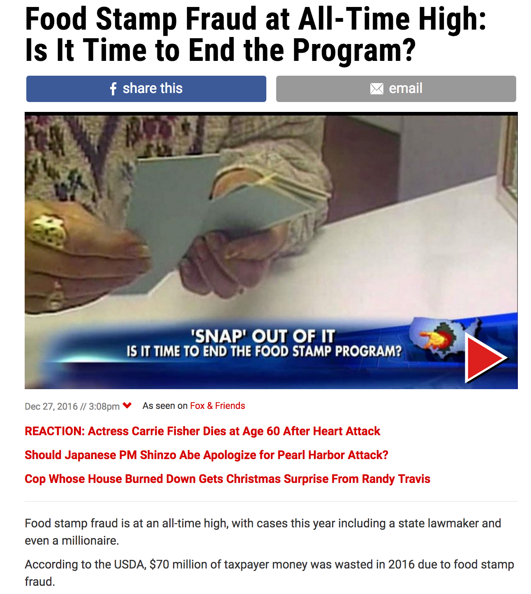
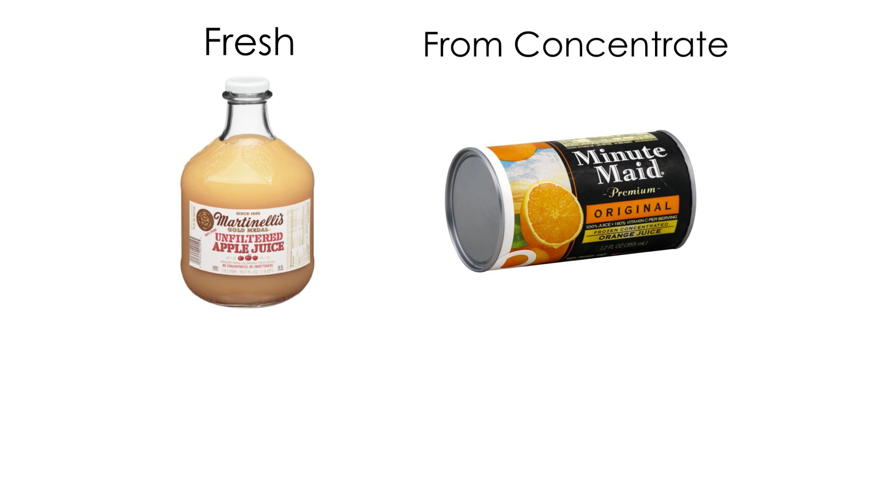
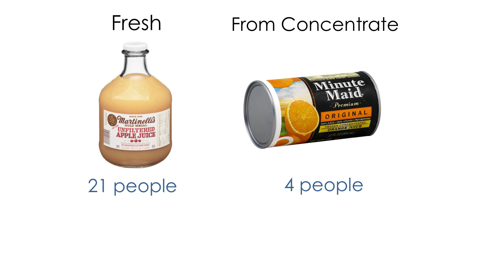
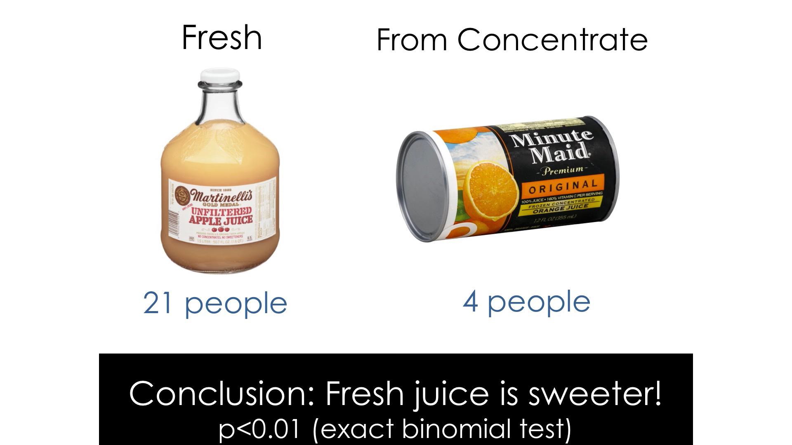
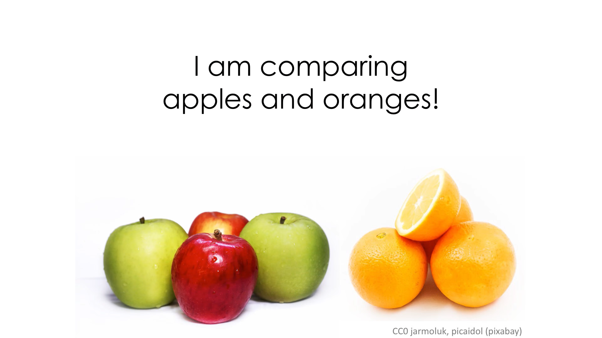
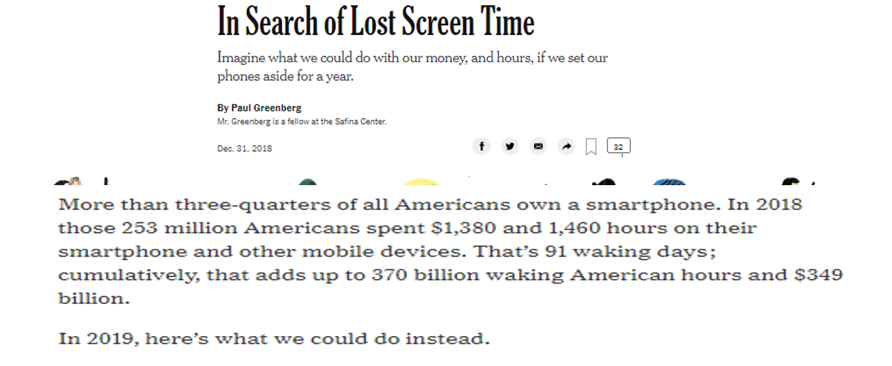
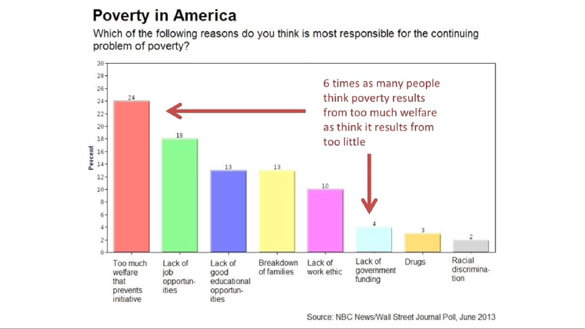
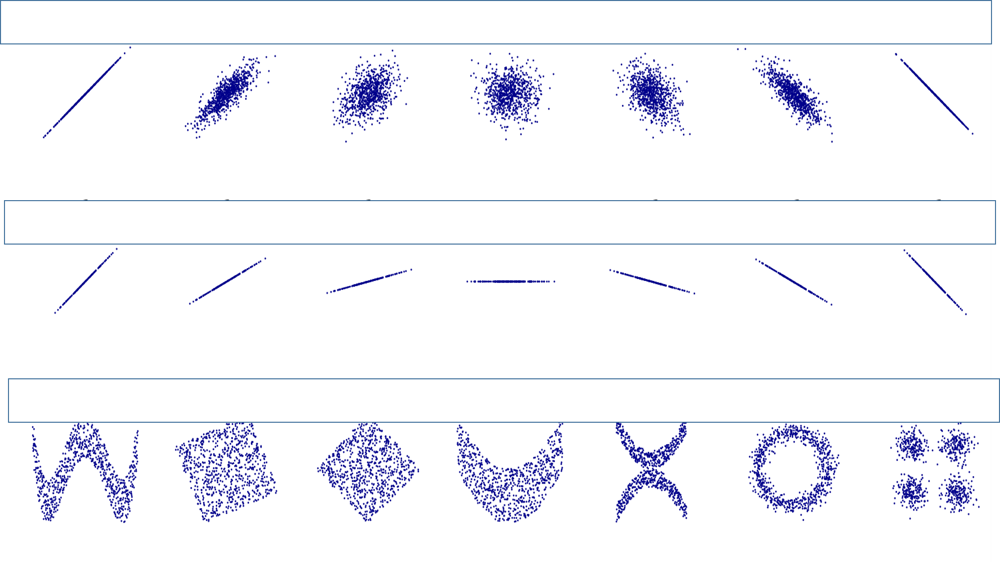

```{r setup, include=FALSE}
options(htmltools.dir.version = FALSE)
```

```{r xaringan-themer, include=FALSE}
library(xaringanthemer)
duo_accent(
  code_font_family = "Fira Code",
  code_font_url    = "https://cdn.rawgit.com/tonsky/FiraCode/1.204/distr/fira_code.css",
title_slide_background_image = "https://ssdp.org/wp-content/uploads/2018/01/app-state-blog-pic.jpg")
```


---

???
notes as i am writing this:
use https://github.com/gadenbuie/xaringanthemer/blob/master/vignettes/template-variables.md to edit the theme itself (like i did above to get the background image of the first slide)

i need to do this for the text for the first slide

use this link to find different styles
https://github.com/gadenbuie/xaringanthemer
---

# Course Goals 
________________
--

## Learn how to think about statistics
--

## Learn how to read and evaluate studies

--

## Learn to separate good stats from bad

--

## Learn how to use R to run analysis 
--


---
class: center, middle

# Why learn R,  a programming language built for statistics
--

## It is *free*
--

## It can do almost anything you need to do
--

## There is a lot of online help
--

## It makes things reproducible 

---


# R Studio
________

#R studio is an **integrated development environment** (IDE) for R that makes it easier to work with R.

##It also does a lot of other things, likes let you [build websites](https://marckissel.netlify.com), create documents, and makes slides all with embedded stats and visualizations  

---


```{r echo=FALSE, message=FALSE, warning=FALSE}
library(DT)
datatable(iris)
```

---
#you can make snazzy visualizations 

```{r include=FALSE, warning=FALSE, message=FALSE}
library(plotly)

data <- read.csv("https://raw.githubusercontent.com/plotly/datasets/master/gapminderDataFiveYear.csv")

data_2007 <- data[which(data$year == 2007),]
data_2007 <- data_2007[order(data_2007$continent, data_2007$country),]
slope <- 2.666051223553066e-05
data_2007$size <- sqrt(data_2007$pop * slope)
colors <- c('#4AC6B7', '#1972A4', '#965F8A', '#FF7070', '#C61951')

p <- plot_ly(data_2007, x = ~gdpPercap, y = ~lifeExp, color = ~continent, size = ~size, colors = colors,
        type = 'scatter', mode = 'markers', sizes = c(min(data_2007$size), max(data_2007$size)),
        marker = list(symbol = 'circle', sizemode = 'diameter',
                      line = list(width = 2, color = '#FFFFFF')),
        text = ~paste('Country:', country, '<br>Life Expectancy:', lifeExp, '<br>GDP:', gdpPercap,
                      '<br>Pop.:', pop)) %>%
  layout(title = 'Life Expectancy v. Per Capita GDP, 2007',
         xaxis = list(title = 'GDP per capita (2000 dollars)',
                      gridcolor = 'rgb(255, 255, 255)',
                      range = c(2.003297660701705, 5.191505530708712),
                      type = 'log',
                      zerolinewidth = 1,
                      ticklen = 5,
                      gridwidth = 2),
         yaxis = list(title = 'Life Expectancy (years)',
                      gridcolor = 'rgb(255, 255, 255)',
                      range = c(36.12621671352166, 91.72921793264332),
                      zerolinewidth = 1,
                      ticklen = 5,
                      gridwith = 2),
         paper_bgcolor = 'rgb(243, 243, 243)',
         plot_bgcolor = 'rgb(243, 243, 243)')


```

```{r echo=FALSE, warning=FALSE, message=FALSE, fig.width=9}
ggplotly(p)
```


---

```{r echo=FALSE, warning=FALSE, message=FALSE, fig.width=9}
library(plotly)
library(gapminder)

p <- gapminder %>%
  plot_ly(
    x = ~gdpPercap, 
    y = ~lifeExp, 
    size = ~pop, 
    color = ~continent, 
    frame = ~year, 
    text = ~country, 
    hoverinfo = "text",
    type = 'scatter',
    mode = 'markers'
  ) %>%
  layout(
    xaxis = list(
      type = "log"
    )
  )

ggplotly(p)
```

---
You can do fun things in presentations:


```{r echo=FALSE}
library(leaflet)
leaflet() %>% addTiles() %>% setView(-81.680244, 36.214232, zoom =17)

```


---
#Things to keep in mind:
You are going to get frustrated. Learning anything takes time and patience. And often times it isn't your fault, but the fault of the program for not making it easy to use! 
--


--


---

class: inverse

# Class mechanics

1. There is no textbook to buy for this class and all the software we will use is free. But free things come with another type of price. In this case I will be building the course as we go and things might be a bit wonky at times. 

## 2. **Assessments**
  - homework will be peer-graded on scale of 0 (didn't do it) to 3 (amazeballs!). 
  - quizzes 
  - final project - in a team you will do a data analysis

  
## 3. Lab time
  - the only way to learn R is to practice. We will have time in class to do this so we can learn together. You also should devote time in the week not just to the homework but to 'playing' with R. It is fun (in a nerdy sort of way)
  

---
class: inverse

# why stats 
__________________________


##Why don't scientists just use common sense?


--


##Simpsons paradox 

the association between a pair of variables
(X, Y ) reverses sign upon conditioning of a third variable, Z. If we partition the data into sub-populations, each representing a specific value of the third variable, the phenomena appears as a sign reversal between the associations measured in the disaggregated subpopulations relative to the aggregated data, which describes the population as a whole.

---
class: center, middle

Sex    | applied  | % accepted
----   | -------  |-----------
Male   | 8,442    | 44%
Female | 4,351    | 35%

---

# Berkeley 1973 gender bias 


# Apply      |  Admitted   |  Sex
____________________________
#    8442    |   44%       |  Male
#    4321    |   35%       |  Female


---


---


---


---
class: center, middle, inverse

# Course Topics  

note: order might change as we work together on this
---
class: center, middle, inverse
# 1. intro to the class <- hey, that's today!
---
class: center, middle, inverse
# 2. Working with data (data entry/storage)

This will talk about best practices for recording data. We will work with Excel and other spreadsheets and talk about common problems. 

---
class: center, middle, inverse
# 3. Overview of R

How to use/install/work with R

---
class: center, middle, inverse
# 4. EDA

How to explore data to get a feel for it
---
class: center, middle, inverse
# 5. data visualization 

How to make useful plots, graphs, etc.
---
class: center, middle, inverse
# 6.  Descriptive Statistics 

mean, median, SD, 
---

class: center, middle, inverse
# 7. Model building

---
class: center, middle, inverse
# 8. Statistical theory 

probability
---
class: center, middle, inverse

# 9. Tools

t-tests, anova

---
class: center, middle, inverse

# 10. Applications

geostats, etc
---
class: center, inverse 

#today's framework

- Some examples of how we can use and misuse stats


---

class: inverse
#Fermi estimations

- Very common in job interviews
- Questions that have to do with guessing values you won't know off hand

---
class: inverse



---

class: center, middle, inverse 

## Estimate how many Americans are on food Stamps
   
    
###is it closer to  1%     10%    50%

---
class: center, middle, inverse 


## Estimate how many Americans are on food Stamps

### closer to 1%     **10%**    50%

---
class: center, middle, inverse 


##  Estimate how much the avg recipient gets 

### closer to $100   $1,000    $10,000
---
class: center, middle, inverse 


##  Estimate how much the avg recipient gets 

### closer to $100   **$1,000**    $10,000


---

class: center, middle, inverse 


##  Estimate how many Americans there are

### closer to 30,000,000   300,000,000     3,000,000,000


---
class: center, middle, inverse 


##  Estimate how many Americans there are

### closer to 30,000,000   **300,000,000**     3,000,000,000

---
class: center, middle, inverse 

# so, total expenditures on food stamp program (not counting admin etc) is about:

## 300,000,000 x .01 x $1000 = $30,000,000,000

--
## $70,000,000 / $30,000,000,000 = **.2% of total expenditures** 

which is not that much lost to fraud....

---
# Unfair comparisons

# You don't have to know anything about stats to see when things aren't being compared in a fair way

---
class: center, inverse



---
class: center, inverse



---

class: center, inverse



---

class: center, inverse




---
class: center, inverse



---
class: center, inverse

background-image: url(https://imgs.xkcd.com/comics/correlation.png)

---
class: center, inverse

# Correlation and Causation


## two variables are **correlated** if knowing one value gives you info on the value of the second variable

### - the way in which they are correlated can be complex...

## -two states are **causally related** when one state influences the other via cause-and-effect


**live example and diagramming relationship** 

independent vs. dependent variable 
---


---

#linear correlations



---


---


#linear correlations


---


[spurious correlations](http://tylervigen.com/spurious-correlations)

---


how can we test?


---
# Reading time...


---


**cooking the books with stats**
.pull-left[
CFO gets following earnings report


Month| Amount earned
---- | -------------
Jan  | $5,000
Feb  | $5,000 
Mar  | $5,000
Apr  | $5,000
May  | $5,000
Jun  | $5,000
Jul  | $5,000
Aug  | $5,000
Sep  | $5,000
Oct  | $5,000
Nov  | $5,000
Dec  | $100,000
]
.pull-right[
She concludes: 
"hey, my avg monthly earning is ~$13,000!"


--

## What is the problem here?

]


---

life expectancy and music 


???
http://theconversation.com/music-to-die-for-how-genre-affects-popular-musicians-life-expectancy-36660

---
# Polling data
________________

In 1936 a magazine poll of **10 million** people (2.4 million responded) predicted that Alf Landon would win the Presidential election.

Data came from subscribers of the magazine, registered car owners, telephone list.

--

## Problems
 
- self-selection (not everyone responds)
- people in the survey were the more wealthy ones


???
The Literary Digest's method for choosing its sample was as follows: Based on every telephone directory in the United States, lists of magazine subscribers, rosters of clubs and associations, and other sources, a mailing list of about 10 million names was created. Every name on this lest was mailed a mock ballot and asked to return the marked ballot to the magazine.

The first major problem with the poll was in the selection process for the names on the mailing list, which were taken from telephone directories, club membership lists, lists of magazine subscibers, etc. Such a list is guaranteed to be slanted toward middle- and upper-class voters, and by default to exclude lower-income voters. One must remember that in 1936, telephones were much more of a luxury than they are today. Furthermore, at a time when there were still 9 million people unemployed, the names of a significant segment of the population would not show up on lists of club memberships and magazine subscribers. At least with regard to economic status, the Literary Digest mailing list was far from being a representative cross-seciton of the population. This is always a critical problem because voters are generally known to vote their pocketbooks, and it was magnified in the 1936 election when economic issues were preeminent in the minds of the voters. This sort of sample bias is called selection bias.

The second problem with the Literary Digest poll was that out of the 10 million people whose names were on the original mailing list, only about 2.4 million responded to the survey. Thus, the size of the sample was about one-fourth of what was originally intended. People who respond to surveys are different from people who don't, not only in the obvious way (their attitude toward surveys) but also in more subtle and significant ways. When the response rate is low (as it was in this case, 0.24), a survey is said to suffer from nonresponse bias. This is a special type of selection bias where reluctant and nonresponsive people are excluded from the sample

???


https://www.jstor.org/stable/2749114?seq=1#metadata_info_tab_contents

---


<iframe width="645" height="363" src="https://www.youtube.com/embed/_2u_eHHzRto" frameborder="0" allow="accelerometer; autoplay; encrypted-media; gyroscope; picture-in-picture" allowfullscreen></iframe>

---


---
class: center, middle, inverse

# Homework 

# Research some statistical fallacies 

## examples:

### Prosecutor's fallacy
    
### Will Rodger's Paradox

